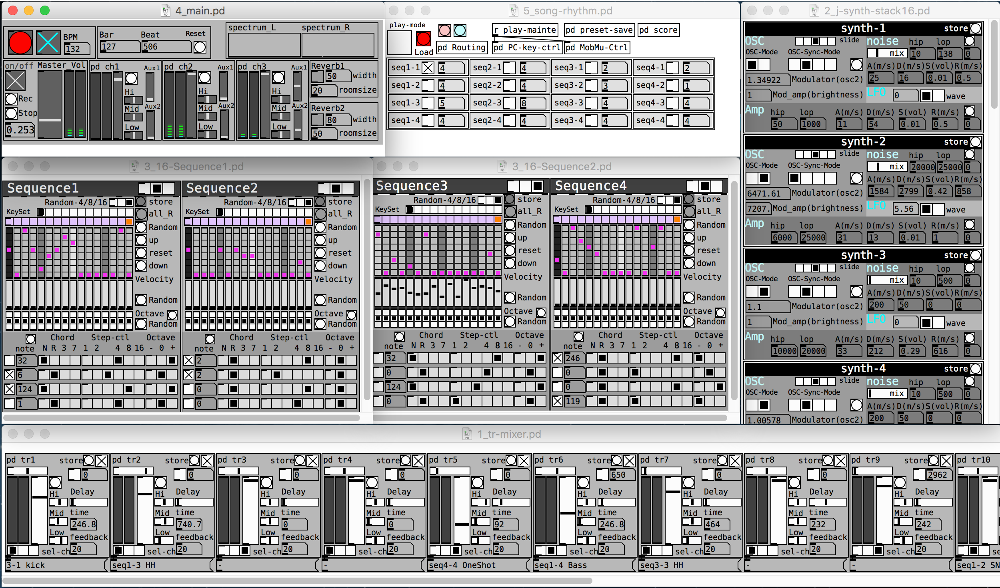

# PureData scale seq LiveTools ver2 vanilla

Generative music production tool created with the visual programming environment "PureData"

This patch was made to perform live with PureData.

Since there is no plan to continue development for now, it will be released.
I hope that it will be useful for your development and study.

## Overview
The patch is roughly organized as follows.
<ul>
    <li> Four step sequencer </ li>
    <li> 16 6 poly FM synthesizers </ li>
    <li> 16ch mixer </ li>
    <li> Song configuration file </ li>
</ul>

## Feature
<ul>
    <li> Scale-based sequencer </ li>
    <li> Randomize generation function for various parameters such as notes and tones </ li>
    <li> Preset management for each song setting file </ li>
</ul>

## System Requirements & Setup
<ul>
    <li> Development: puredata vanilla 0.48.1 </ li>
    <li> Extension library: check the following </ li>
</ul>

<a href="https://blog.creative-plus.net/archives/7695" target="_blank"> Extension library setup using deken (Japanese) </a>

## How to use
<ol>
    <li> Basic, start in the order of the numbers at the top of the file </ li>
    <li> On Mac, click “_open.command” to automatically start up to “4_main.pd” </ li>
    <li> "5_" files are song individual settings files </ li>
</ol>
